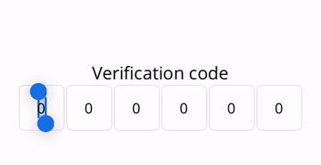
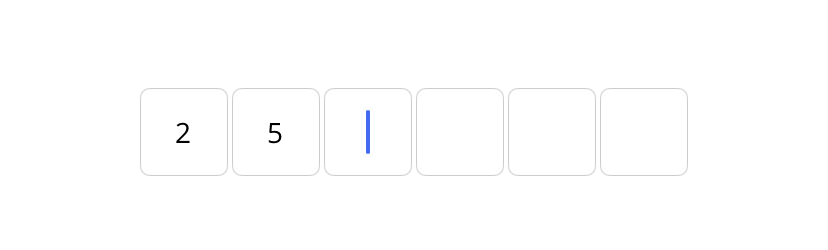
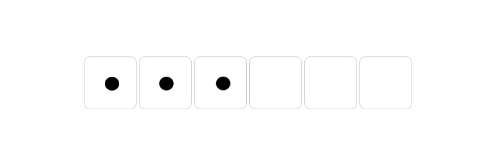
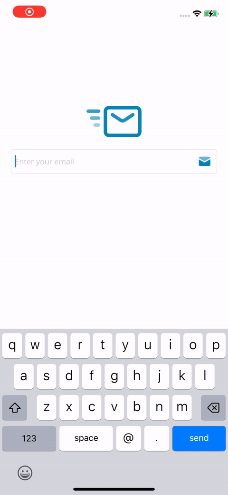

[🇺🇸 EN](README.md) | 🇪🇸 ES

# OTPEntry

OTPEntry es una biblioteca de .NET MAUI para crear controles de entrada de Contraseña de Un Solo Uso (OTP). Esta biblioteca soporta entradas OTP alfanuméricas y numéricas y proporciona una interfaz de usuario personalizable.

<div style="margin: 20px 0;">
  
</div>

## Características

- Soporta entradas OTP alfanuméricas y numéricas
- Longitud de entrada personalizable
- Retroalimentación háptica al completar el código
- Fácil integración con proyectos .NET MAUI

## Instalación

Para instalar OTPEntry, ejecute el siguiente comando en la Consola del Administrador de Paquetes NuGet:

```sh
dotnet add package FreakzDEV.OTPEntry --version 1.0.3
```
<div style="margin: 20px 0;">
  <a href="https://www.nuget.org/packages/FreakzDEV.OTPEntry" style="text-decoration: none;color: #004880;">
    <div style="display: inline-flex;gap:10px;align-items: center;">
      
      <span style="font-weight: 900; font-size: 20px;">Nuget Package</span>
    </div>
  </a>
</div>

## Versión

Versión actual: 1.0.3

<div style="margin: 20px 0;">
  
  
</div>

## Propiedades

<table style="border: 1px solid #4d4d4d50;">
  <tr style="font-weight: 900;background-color:#4d4d4d20;"><td>Propiedad</td><td>Descripción</td><td>Valor Predeterminado</td></tr>
  <tr><td style="font-weight: 600;">Length</td><td>La longitud del OTP.</td><td>6</td></tr>
  <tr><td style="font-weight: 600;">Type</td><td>Define el tipo de teclado, ya sea alfanumérico o numérico.</td><td>Numeric</td></tr>
  <tr><td style="font-weight: 600;">IsPassword</td><td>Define si el código es visible o no.</td><td>false</td></tr>
  <tr><td style="font-weight: 600;">OTP</td><td>Propiedad de solo lectura para obtener el código ingresado.</td><td>N/A</td></tr>
</table>

## Métodos

- **Focus**: Establece el enfoque en el control.
- **Unfocus**: Elimina el enfoque del control.
- **Clear**: Borra el código ingresado en el control.

## Eventos

- **OTPCompleted**: Se activa cuando se completa el código ingresado.

## Comandos

- **Command**: Un `ICommand` que se ejecuta cuando se completa el código ingresado.

## Uso

Aquí hay un ejemplo de cómo usar OTPEntry en su proyecto .NET MAUI:

### Implementación en C#

```csharp
using FreakzDEV.OTPEntry;

namespace YourNamespace
{
  public partial class MainPage : ContentPage
  {
    public MainPage()
    {
      InitializeComponent();

      var otpEntry = new OTPEntry.Entry
      {
        Length = 6,
        Type = OTPEntry.Type.Numeric
      };

      otpEntry.CodeCompleted += (sender, e) =>
      {
        Debug.WriteLine($"Código Ingresado: {e.Code}");
      };

      Content = otpEntry;
    }
  }
}
```

### Implementación en XAML

```xml
<?xml version="1.0" encoding="utf-8" ?>
<ContentPage xmlns="http://schemas.microsoft.com/dotnet/2021/maui"
       xmlns:x="http://schemas.microsoft.com/winfx/2009/xaml"
       xmlns:otp="clr-namespace:FreakzDEV.OTPEntry;assembly=FreakzDEV.OTPEntry"
       x:Class="YourNamespace.MainPage">

  <StackLayout Padding="20">
    <Label Text="Ingrese el Código OTP"
         FontSize="Medium"
         HorizontalOptions="Center"
         VerticalOptions="Center" />

    <otp:Entry Length="6"
           Type="Numeric"
           CodeCompleted="OnCodeCompleted"
           HorizontalOptions="Center"
           VerticalOptions="Center" />
  </StackLayout>
</ContentPage>
```

```csharp
using System;
using Microsoft.Maui.Controls;
using FreakzDEV.OTPEntry;

namespace YourNamespace
{
  public partial class MainPage : ContentPage
  {
    public MainPage()
    {
      InitializeComponent();
    }

    private void OnCodeCompleted(object sender, OTPEntryEventArgs e)
    {
      var mainPage = Application.Current?.Windows[0]?.Page;
      if (mainPage != null)
      {
        Debug.WriteLine($"Código Ingresado: {e.Code}");
      }
    }
  }
}
```

## Ejemplo

<div style="margin: 20px 0;">
  
</div>

## Licencia

Este proyecto está licenciado bajo la Licencia MIT. Consulte el archivo LICENSE para más detalles.

## Contacto

Para cualquier pregunta o comentario, por favor contáctenos en [support@freakz.dev](mailto:support@freakz.dev).