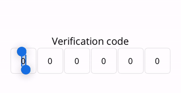
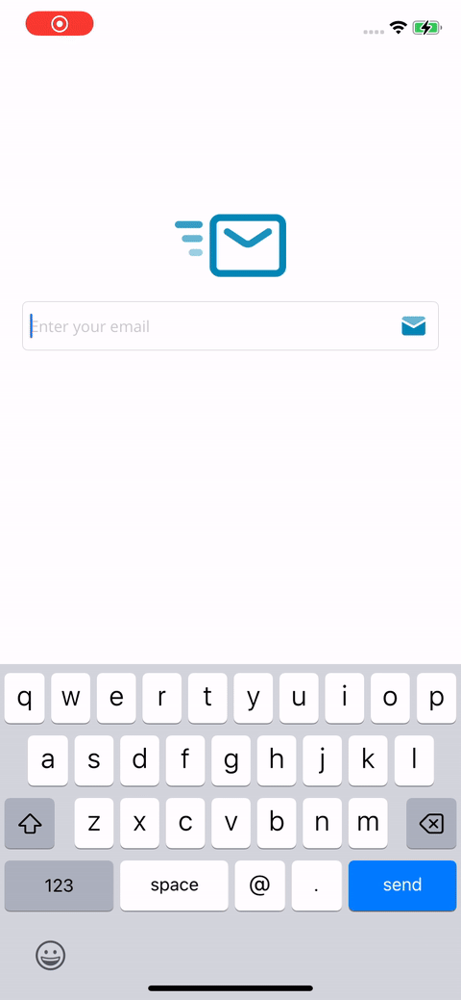

# OTPEntry

OTPEntry is a .NET MAUI library for creating One-Time Password (OTP) entry controls. This library supports alphanumeric and numeric OTP entries and provides a customizable user interface.

<div style="margin: 20px 0;">
    
</div>

## Features

- Supports alphanumeric and numeric OTP entries
- Customizable entry length
- Haptic feedback on code completion
- Easy integration with .NET MAUI projects

## Installation

To install Feedback, run the following command in the NuGet Package Manager Console:

```sh
Install-Package OTPEntry
```

## Version

Current version: 1.0.0

<div style="margin: 20px 0;">
    
    
</div>

## Properties

<table style="border: 1px solid #4d4d4d50;">
    <tr style="font-weight: 900;background-color:#4d4d4d20;"><td>Property</td><td>Description</td><td>Default Value</td></tr>
    <tr><td style="font-weight: 600;">Length</td><td>The length of the OTP.</td><td>6</td></tr>
    <tr><td style="font-weight: 600;">Type</td><td>Defines the type of keyboard, either alphanumeric or numeric.</td><td>Numeric</td></tr>
    <tr><td style="font-weight: 600;">IsPassword</td><td>Defines whether the code is visible or not.</td><td>false</td></tr>
    <tr><td style="font-weight: 600;">OTP</td><td>Read-only property to get the entered code.</td><td>N/A</td></tr>
</table>

## Methods

- **Focus**: Sets focus on the control.
- **Unfocus**: Removes focus from the control.
- **Clear**: Clears the entered code in the control.

## Events

- **OTPCompleted**: Triggered when the entered code is completed.

## Commands

- **Command**: An `ICommand` that executes when the entered code is completed.

## Usage

Here is an example of how to use OTPEntry in your .NET MAUI project:

### C# Implementation

```csharp
using OTPEntry;

namespace YourNamespace
{
    public partial class MainPage : ContentPage
    {
        public MainPage()
        {
            InitializeComponent();

            var otpEntry = new OTPEntry.Entry
            {
                Length = 6,
                Type = OTPEntry.Type.Numeric
            };

            otpEntry.CodeCompleted += (sender, e) =>
            {
                Debug.WriteLine($"Entered Code: {e.Code}");
            };

            Content = otpEntry;
        }
    }
}
```

### XAML Implementation

```xml
<?xml version="1.0" encoding="utf-8" ?>
<ContentPage xmlns="http://schemas.microsoft.com/dotnet/2021/maui"
             xmlns:x="http://schemas.microsoft.com/winfx/2009/xaml"
             xmlns:otp="clr-namespace:OTPEntry;assembly=OTPEntry"
             x:Class="YourNamespace.MainPage">

    <StackLayout Padding="20">
        <Label Text="Enter OTP Code"
               FontSize="Medium"
               HorizontalOptions="Center"
               VerticalOptions="Center" />

        <otp:Entry Length="6"
                   Type="Numeric"
                   CodeCompleted="OnCodeCompleted"
                   HorizontalOptions="Center"
                   VerticalOptions="Center" />
    </StackLayout>
</ContentPage>
```

```csharp
using System;
using Microsoft.Maui.Controls;
using OTPEntry;

namespace YourNamespace
{
    public partial class MainPage : ContentPage
    {
        public MainPage()
        {
            InitializeComponent();
        }

        private void OnCodeCompleted(object sender, OTPEntryEventArgs e)
        {
            var mainPage = Application.Current?.Windows[0]?.Page;
            if (mainPage != null)
            {
                Debug.WriteLine($"Entered Code: {e.Code}");
            }
        }
    }
}
```

## License

This project is licensed under the MIT License. See the LICENSE file for more details.

## Contact

For any questions or feedback, please contact us at [support@freakz.dev](mailto:support@freakz.dev).

## Sample

<div style="margin: 20px 0;">
    
</div>